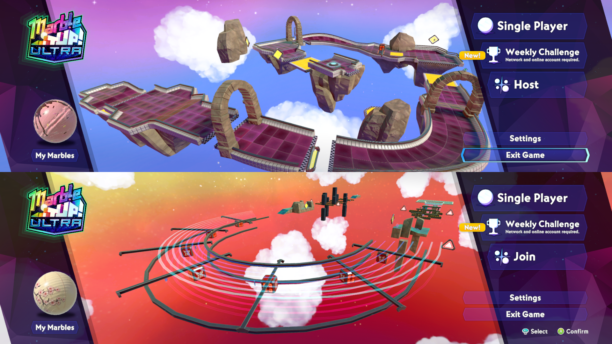
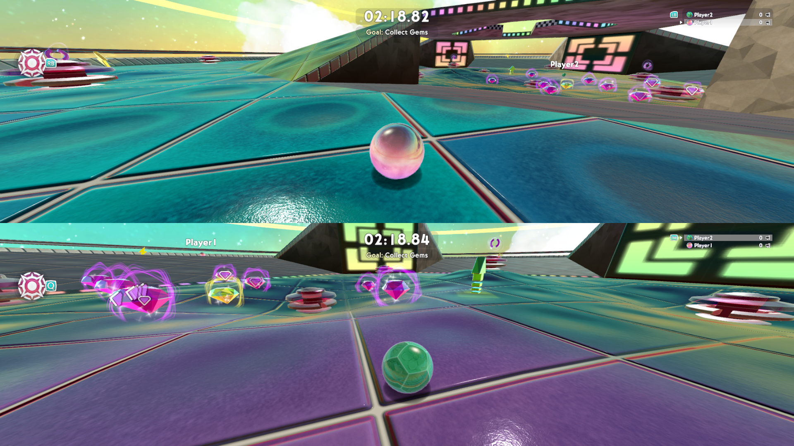

# MIUU LAN Splitscreen

A mod for **Marble It Up! Ultra** that runs multiplayer as local splitscreen. 
Start one game
instance per player on the same PC, and the instances connect to each other over loopback. 
This removes room codes and public servers. 
Everything can be controlled with a gamepad.

This is designed for use with PartyDeck and currently targets the Linux (native Steam build) only. 
It uses thearst3rd's [MIUU Mod Loader](https://codeberg.org/thearst3rd/miuu-mod-loader) for loading.






## Install

1. Download `MIUULan-<version>.zip` and unzip it anywhere.
2. Run the installer:
   ```sh
   ./install.sh                          # default Steam library path
   ./install.sh "/path/to/Marble It Up!" # or point it at the game
   ./install.sh --console                # also install MIUU Console Unlocker
   ```
   The installer downloads the mod loader and installs `Mods/MIUULan/MIUULan.dll`.

## Play

This is designed to be played with PartyDeck using the attached handler. 

Alternatively, you can try to run this manually. Start one instance per player, each with its own profile directory:

```sh
cd "$HOME/.local/share/Steam/steamapps/common/Marble It Up!"
XDG_CONFIG_HOME=~/.local/share/miuulan/p1 ./run.sh ./MarbleItUp.x86_64 -player 0 -unlockcosmetics -randomskin -nosteam &
XDG_CONFIG_HOME=~/.local/share/miuulan/p2 ./run.sh ./MarbleItUp.x86_64 -player 1 -unlockcosmetics -randomskin -nosteam &
```

- **Player 0** hosts. Its Multiplayer button opens the private game menu, where you pick a mode
  and map and press Start.
- **Players 1 and up** join. Their Multiplayer button connects straight to player 0. If the host
  isn't ready yet, the join times out and you just press Multiplayer again. (Slightly buggy)

I recommend players 1+ disable music in their profile settings.

## Game command-line flags

| Flag | Effect |
|---|---|
| `-player N` | Enables LAN mode as player N. (Binds UDP port `39010 + N`, but player 0 always hosts). |
| `-unlockcosmetics` | Unlock all cosmetics without editing the save file or unlocking any achievements. |
| `-randomskin` | Start each player a random unlocked marble skin. They can still change it. |
| `-nosteam` | Never starts Steam. Saves time and prevents errors when Steam is missing or emulated (PartyDeck/Goldberg). Saves are keyed to an offline ID, so use a separate profile. |
| `-lan` | LAN mode without a role. Use the console commands below. |

Console commands, which need the console mod that `install.sh --console` adds: `lanhost` and
`lanjoin [port | ip:port]`.

## Build from source

Since this build compiles against real game DLLs, you need the game installed and a .NET 8 SDK.

```sh
scripts/dev-re-tools.sh      # set up environment
scripts/build.sh [GameDir]   # build and copy MIUULan.dll. run with DEBUG_OVERLAY=1 to enable overlay status
scripts/install.sh           # installs the local build and modloaders

scripts/package.sh           # for releases: packages dist/MIUULan-<version>.zip
```

## AI disclosure

Some research and code generation for this project was done with LLM assistance. 
